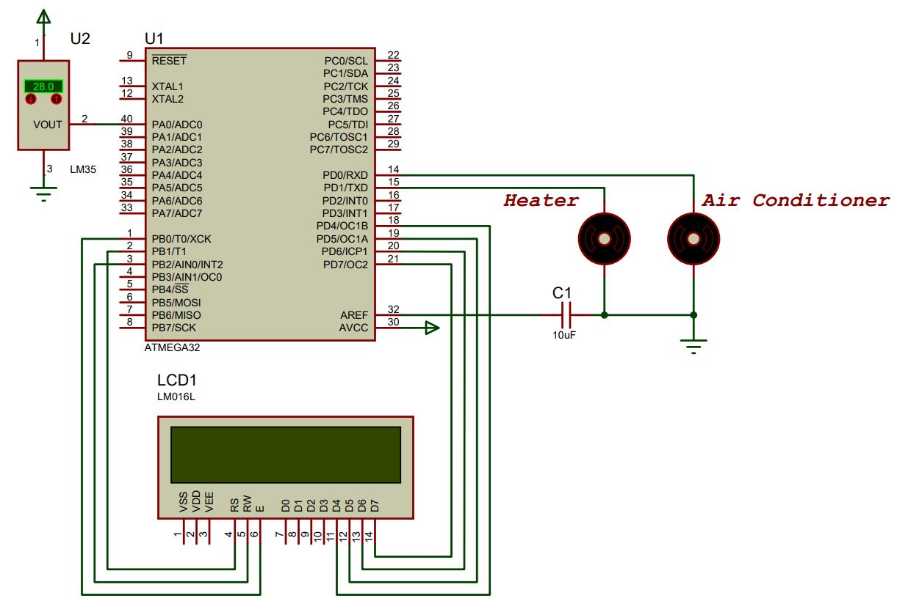

# Autonomous-Heater-and-Air-Conditioner
Automatically Detects the rise and fall in the temperature with the help of LM35 Temperature sensor and accordingly turns on/off the Heater and Air Conditioner with the help of AVR Microcontroller. 

Simulation Software Used: Proteus Design Suite - 8.11

|  | 
|:--:| 
| **Circuit Diagram:** *Complete circuitry rigged up in Proteus simulation software* |

## Working: 
Whenever the temperature moniterd by the LM35 Temperature Sebsor goes below 20 degree celsius the **heater gets turned on** and whenever the temperature goes beyond 30 degree celsius (threshold) the **Air conditioner gets turned on**.

